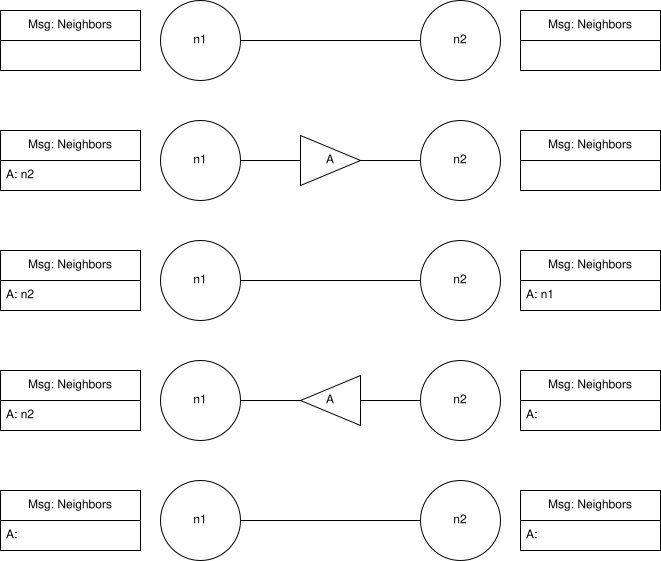

# Challenge #2: Unique ID Generation
https://fly.io/dist-sys/2/

## Single Node
A single node which generates UIDs is the simplest case. The node will keep
track of a counter in memory which it uses to assign a UID to each incoming
requests. The obvious issues with this approach will give us a concrete
place to begin:
1. It's not a distributed system (ha)
1. Node will redistribute IDs after it reboots, so the IDs aren't unique
1. Increased latency for concurrent requests due to contention for the counter
1. Impossible to scale horizontally because the current UID is managed by a node
1. The UID node is a single point of failure for anything dependent upon it
1. The number of available IDs is limited by the maximum value an integer type
can store in memory (implementation detail)

## Randomly Generated UIDs, Stored Centrally
Nodes will write generated UIDs to shared storage to coordinate which UIDs are
available. Nodes will regenerate UIDs if they generate an unavailable UID. 
Issues with this approach:
1. It's not a distributed system
1. Race condition when two nodes generate the same, available UID
1. The UID storage becomes a single point of failure
1. The number of available IDs is limited by the maximum value an integer type
can store in memory. A sufficiently large pool of UIDs is required to avoid
collisions.
Compariston to previous attempt:
1. Horizontally scalable, but may suffer from diminishing returns as competition
for central storage increases
1. The UID node is no longer a single point of failure

### Results
```
./maelstrom test -w unique-ids --bin /maelstrom/node --time-limit 5 --rate 10 --node-count 1 --availability total --nemesis partition
```
Ran a simple case to see if this is working as expected. No collisions were
detected, but that's expected with such a short test and a UID pool so large.
I expect this will work fine scaled up to three nodes. I'm a bit curious to see
what pool size will be sufficient to avoid failures. Of course, it all depends
on the test length. UID exhaustion with this strategy is an obvious flaw.

```
./maelstrom test -w unique-ids --bin /maelstrom/node --time-limit 30 --rate 1000 --node-count 3 --availability total --nemesis partition
```
Works decently well. Latency under 10ms for the most part. I didn't see any
collisions. I reduced the pool of available UIDs a few times to simulate the
gradual exhaustion of available IDs. This is a pretty big issue that makes this
solution untenable. I implemented some basic retry logic (yes, I know infinite
retries are dumb) and ran into the expected failures at the end of the test run.
The server became some busy with retries that new tests failed. I'll add a limit
to retries just to get the test to complete without errors and see how many UID
generations fail. Results are still awful

I didn't get around to implementing this idea, but my next thought was: why does
the generator need to store ALL the IDs indefinitely? this would solve the issue
of pool exhaustion. At the beginning of each day, we can clear the "used UID"
pool and forget about checking ALL the UIDs that have been generated since the
start of the system. The issue there is we need a way to distinguish groups of
IDs by day. To do that, a simple sequence number can be used that tracks what
day the UID was generated:

[ DAY : int ][ SEQUENCE NUMBER : int ]

This still relies on a central system to track the current pool of UIDs, which
isn't a distributed system. I knew time was an important aspect of the solution
to the UID problem because I read about UUIDs a few years ago (Twitter
snowflakes, specifically). But I couldn't remember the full solution.

Here's my favorite part:

I ended up posing this problem to my sister for fun. She came up with a
brilliant idea in just a few minutes. Each node can generate it's own set of
unique ideas using a sequence number and a node identifier. Her UIDs would
be of the form:

[ NODE ID : int ][ SEQUENCE NUMBER : int ]

My critique was that the management of the node IDs would be a chore; there
should never be a case where two nodes use the same ID. Managing that over
time with nodes that can come and go would be very annoying; one slip up and
you've got data corruption.

She was SO CLOSE to coming up with Twitter's snowflake ID and she has no
background in system design or software engineering. Truly amazing. We only
discussed the problem for maybe 15 minutes, tops.

I caved and looked up the ID format of Twitter's snowflakes the same night.

It became immediately apparent why their solution is so brilliant:
1. The milliseconds since epoch portion of their UID means that EVERY
MILLISECOND, there is a fresh pool of unique IDs, similiar to my day
refresh solution, but on a much shorter scale.
1. The sequence ID is similar to the basic, single node solution. The
sequence number is refreshed every millisecond.

At this point, we have an infinite number of UIDs to work with. The issue
remaining is: how do we do this in many different places without coordination?

The machine ID ties the two solutions together beautifully. Putting a machine
ID in the UID guarantees that each node will generate unique IDs as long as
their clock is locally consistent and no other node shares the same ID. This
does not mean however, that machine IDs must be universally unique. The
component of time means that machine IDs can be reused as long as two machines
with the same ID never exist at the same time. This eliminates the issue of
ID exhaustion based on the size of the machine ID portion of the UID.

The time portion of the UID ensures that there is always IDs available.
The machine ID guarantees that each machine will generate unique IDs.
And the sequence number defines the pool of available IDs each millisecond in
a stupidly simple way.

Absolutely brilliant. With a bit more refinement of our combined solutions, we
would have arrived at the solution. It's important to think about the attributes
of data that we can utilize and how they can form emergent properties when
combined. It's worthwhile to think through simple solutions because they still
have value, even when working on complex problems.

# Challenge #3: Broadcast
Broadcasts need to be more efficient. Initially, I would just fire and forget
a new broadcast to all neighbors of each node. Issues with this approach:
1. Loops will cause network flooding. Broadcasts will be propagated forever
1. Inefficient to send a message to all neighbors. Only neighbors who haven't
seen the message need to get it.

Point #2 is a bit interesting. With a fire and forget approach, it's not
possible to guarantee that a neighbor received a broadcast. However, each node
can track who sent it a message. The node can skip sending a message to a 
neighbor who already has it, because the neighbor was the one who sent it to
the node!

There is still a large issue, though. How does the system recover from a
partition? If a message is only broadcast once, while the network is
partitioned, how will the nodes in the partition without the sender get the
data? They can't request the data, because they don't know about it.

Is it possible for the nodes to detect a partition, then trigger recovery
procedures? Or perhaps a periodic check-in with other nodes is sufficient?

The former seems more resource efficient, but more complex. The latter is
simpler, but more resource inefficient.

## Challenge #3c: Fault Tolerant Broadcast
I did a little whiteboarding and realized I can use a handshake of sorts to
confirm that a message has been propagated to all neighbors! 

Here's the basics of the program
1. If the node hasn't seen the message before
    1. Initialize a map of message to neighbor on receipt of a new message
    1. Send all outstanding messages to truant neighbors
1. If the sender is not in the map for message
    1. Send the message back to the sender
1. Delete the sender from the map



The diagram shows the full exchange between two neighbors in the absence of a
partition. Now, consider partitions at each step where a message is in flight:
Step 2: The state of the graph will revert to Step 1. We can ignore this case
Step 4: n1 will send a message to n2 later. n2 will send the message back to n1
as confirmation. Eventually, the n1 will get the acknowledgement and stop
sending message A

The way I currently implemented this is very inefficient, especially with a
large amount of messages; outstanding messages will be sent out on every new
message. I need a mechanism which will send outstanding messages under specific
conditions that won't flood the network. In addition, the eventual consistency
guarantee only works if there is a constant flow of messages. Outstanding
messages will never make it if the flow of new messages stops!
